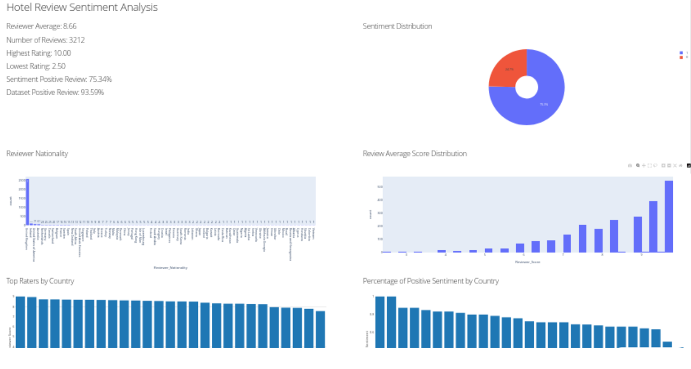
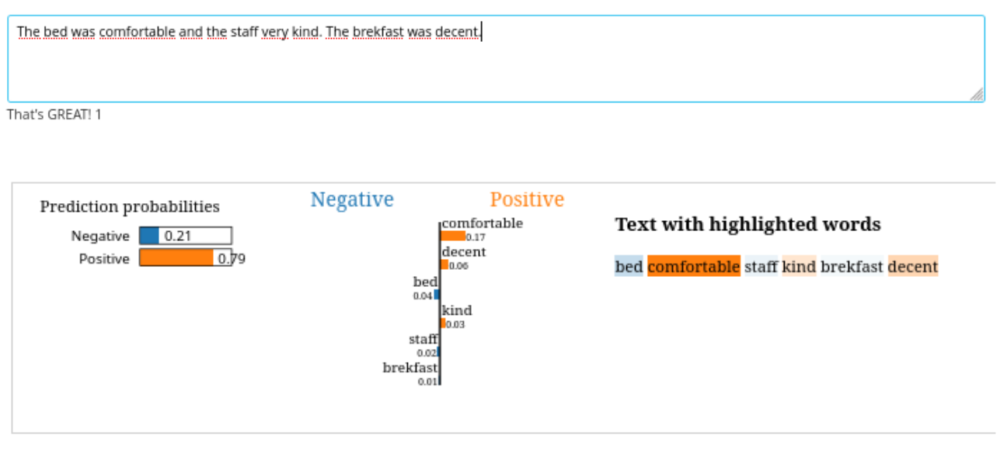

# HotelReviewDashboard
Hotel Review Dashboard - an analysis dashboard for hotel reviews using NLP techniques.

Data Analytics **Project** - *A.Y. 2022/23*

## Benchmark Datasets:

*   **515K Hotel Reviews Data in Europe** - [Kaggle Dataset](https://www.kaggle.com/code/jonathanoheix/sentiment-analysis-with-hotel-reviews) from Booking.com

## Abstract
In today's digital era, consumers increasingly rely on ratings and reviews provided by other users as decision-making tools, especially when planning trips to new destinations. In this context, reviews and scores assigned by users play a significant role, capable of significantly influencing the reputation of a hotel and indirectly impacting revenue.

The main objective of this project is to identify words that can serve as indicators of positive or negative reviews, and understand how such words influence the overall outcome of a certain review. Through the application of advanced techniques in Sentiment Analysis and Natural Language Processing (NLP), we aim to analyze the content of reviews written by users to comprehend how these words impact the overall judgment of a hotel.

This paper addresses both the business and consumer sides. Regarding the business aspect, identifying words that have a major impact on the judgment of a review will enable hotel structures to identify which aspects of their hotel need improvement to maintain quality service. This will allow them to adapt to customer expectations and preserve a positive reputation, resulting in increased revenue.

On the other hand, consumers may benefit from the analyses presented as they are provided with a tool to discover which words are most effective in positively or negatively influencing the reputation of a hotel. This will enable them to write more impactful reviews and become more aware of the impact of specific words contained in reviews.

Finally, a dashboard is proposed that effectively performs sentiment analysis in real-time, providing a user-friendly tool for both business and consumer users to leverage the potential of the proposed models to extract meaningful insights and make data-driven decisions.

## Dashboard
A sceen of the builded dashboard

## Review Sentiment Sample
An example of the sentiment analysis of a user review

